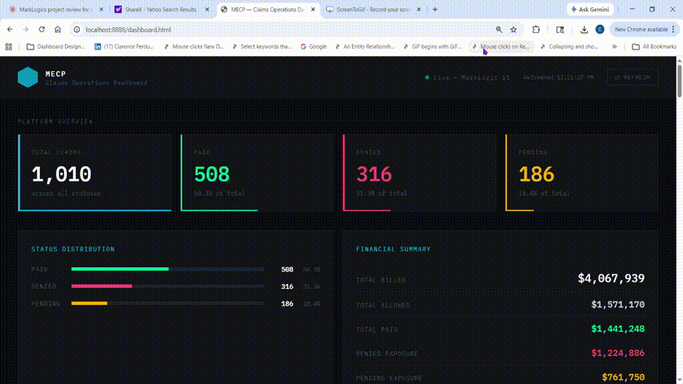

# MarkLogic Enterprise Claims Platform (MECP)


      


      


      


> Enterprise-grade healthcare claims processing platform built on MarkLogic 11
> Fully containerized - Deployable in 3 commands - Verifiable in 5 minutes

---

## What This System Does

This project is a **healthcare claims data engineering platform** that demonstrates
a complete data pipeline from raw input to analytics-ready output.

```
Raw JSON Claims
      |
      v
Ingestion Layer        <- MLCP bulk load (1000 claims)
      |
      v
Transformation         <- CORB 6-step pipeline
      |
      v
Unified Storage        <- MarkLogic 11 NoSQL database
      |
      v
REST API + Dashboard   <- Live analytics and reporting
```

**Core capabilities demonstrated:**
- Ingest data from multiple sources using MLCP (MarkLogic Content Pump)
- Clean and transform data through a controlled 6-step CORB pipeline
- Structure data into a unified NoSQL document store with range indexing
- Deliver data through a REST API and live HTML executive dashboard
- Query semantic relationships using RDF triples and SPARQL

**Built to federal consulting delivery standards - IBM, Booz Allen, TATA level.**

---

## Quick Start - 3 Commands

```powershell
# 1 - Clone
git clone https://github.com/PerdueCo/health-claims-hub
cd health-claims-hub

# 2 - Start (first run takes 2-3 minutes)
docker compose up -d

# 3 - Verify
powershell -ExecutionPolicy Bypass -File scripts\verify.ps1
```

**Expected result:**
```
========================================
Result: 6 PASSED | 0 FAILED
Platform is READY for demonstration
========================================
```

---

## Live Dashboard

```powershell
python serve_dashboard.py
```

Open Chrome: `http://localhost:8888/dashboard.html`



---

## What This Platform Demonstrates

| Capability | Technology | Status |
|---|---|---|
| Containerized deployment | Docker Compose + Roxy | Complete |
| Automated bootstrap | Roxy ml deploy pipeline | Complete |
| REST API layer | XQuery on MarkLogic App Server | Complete |
| Claims collection endpoint | GET /v1/resources/claims | Complete |
| Status filter | ?status=PAID, DENIED, PENDING | Complete |
| Single claim lookup | ?id=CLM-0001 | Complete |
| Search and indexing | cts:values, element range index | Complete |
| Bulk data load | MLCP - 1000 claims loaded | Complete |
| Batch processing | CORB - 6-step pipeline, 1010 claims | Complete |
| Semantic triples | RDF triple store - 8000 triples | Complete |
| SPARQL queries | Aggregation and filter queries on live data | Complete |
| Live dashboard | HTML dashboard with proxy server | Complete |

---

## System Architecture


```
+--------------------------------------------------+
|                  CLIENT LAYER                    |
|    curl / Postman / verify.ps1 / dashboard       |
+--------------------+-----------------------------+
                     |
         +-----------+-----------+
         v                       v
+---------------+         +---------------+
|   Port 8040   |         |   Port 8000   |
|   REST API    |         |   App Svcs    |
|   basic auth  |         |  digest auth  |
+-------+-------+         +-------+-------+
        |                         |
        +-----------+-------------+
                    v
+--------------------------------------------------+
|             MarkLogic 11  (Port 8002)            |
|                                                  |
|  Database: roxy-content                          |
|  +-- 10 seed JSON claim documents                |
|  +-- 1000 bulk JSON claim documents (MLCP)       |
|  +-- Element range index on status field         |
|  +-- 8000 RDF triples (named graph)              |
|  +-- CORB pipeline applied to all claims         |
|                                                  |
|  Database: roxy-modules                          |
|  +-- 81 XQuery modules deployed by Roxy          |
+--------------------------------------------------+
```

---

## Data Pipeline


The 6-step CORB pipeline processes every claim document in sequence:

| Step | Transform | What It Does |
|---|---|---|
| 1 | validate-claim | Checks required fields are present |
| 2 | enrich-claim | Adds processingDate and platformVersion |
| 3 | categorize-claim | Assigns priority based on amountBilled |
| 4 | flag-high-value | Flags claims over $5000 for review |
| 5 | normalize-status | Uppercases and trims status field |
| 6 | mark-processed | Adds pipelineComplete: true |

Load bulk claims and run the pipeline:
```powershell
python scripts\generate_claims.py
python scripts\run_pipeline.py
```

---

## Semantic Triples and SPARQL

8000 RDF triples stored in named graph `http://mecp/claims/graph`.

Query total billed by status:
```powershell
curl.exe --digest -u admin:admin123 `
  --data-urlencode "xquery@corb/sparql-amount-by-status.xqy" `
  --data "database=roxy-content" `
  http://localhost:8000/v1/eval
```

Sample result:
```
Status: DENIED  | Claims: 310 | Total Billed: $1,187,432
Status: PAID    | Claims: 505 | Total Billed: $2,043,217
Status: PENDING | Claims: 185 | Total Billed: $743,891
```

See [docs/SPARQL_GUIDE.md](docs/SPARQL_GUIDE.md) for full documentation.

---

## API Reference

### GET all claims
```powershell
curl.exe -u admin:admin123 http://localhost:8040/v1/resources/claims
```

### Filter by status
```powershell
curl.exe -u admin:admin123 "http://localhost:8040/v1/resources/claims?status=PAID"
curl.exe -u admin:admin123 "http://localhost:8040/v1/resources/claims?status=DENIED"
curl.exe -u admin:admin123 "http://localhost:8040/v1/resources/claims?status=PENDING"
```

### Single claim lookup
```powershell
curl.exe -u admin:admin123 "http://localhost:8040/v1/resources/claims?id=CLM-0001"
```

**Sample response:**
```json
{
  "total": 1010,
  "claims": [
    {
      "claimId": "CLM-0001",
      "memberId": "M-10001",
      "provider": "Peachtree Clinic",
      "serviceDate": "2026-02-25",
      "status": "PAID",
      "amountBilled": 420,
      "amountAllowed": 310,
      "amountPaid": 295,
      "diagnosisCodes": ["Z00.00"],
      "facility": { "state": "GA", "city": "Atlanta" }
    }
  ]
}
```

---

## Port Reference

| Port | Service | Auth | Purpose |
|---|---|---|---|
| 8001 | MarkLogic Admin UI | admin/admin123 | Browser administration |
| 8002 | Manage API | Digest | Health and management |
| 8000 | App Services | Digest | /v1/eval, /v1/ping, SPARQL |
| 8040 | MECP REST Server | Basic | Claims API endpoints |
| 8041 | XDBC Server | Basic | MLCP bulk ingest port |

---

## Repository Structure

```
health-claims-hub/
+-- README.md                        <- This file
+-- TESTING.md                       <- Six-level verification guide
+-- CORB_GUIDE.md                    <- CORB pipeline documentation
+-- docker-compose.yml               <- One-command platform startup
+-- dashboard.html                   <- Live claims dashboard
+-- serve_dashboard.py               <- Dashboard proxy server
|
+-- docs/
|   +-- MECP_System_Architecture.png <- System architecture diagram
|   +-- MECP_Data_Pipeline.png       <- Data pipeline diagram
|   +-- SPARQL_GUIDE.md              <- SPARQL query documentation
|   +-- RCA_MarkLogic_Upgrade.md     <- Incident root cause analysis
|   +-- HIPAA_COMPLIANCE.md          <- HIPAA compliance documentation
|   +-- MECP_Setup_Guide.pdf         <- Step-by-step setup guide
|   +-- api-reference.md             <- Full API documentation
|   +-- sample-api-response.json     <- Sample API output
|   +-- MECP_Dashboard_Demo.gif      <- Live dashboard demo
|
+-- claims-roxy/
|   +-- deploy/ml-config.xml         <- Databases, forests, range indexes
|   +-- src/app/claims.xqy           <- REST API controller (XQuery)
|
+-- corb/
|   +-- selector.xqy                 <- CORB document selector
|   +-- transform.xqy                <- CORB 6-step pipeline
|   +-- triples-generate.xqy         <- RDF triple generator
|   +-- sparql-amount-by-status.xqy  <- SPARQL aggregation query
|   +-- sparql-pending-by-provider.xqy <- SPARQL filter query
|
+-- data/bulk-claims/                <- 1000 JSON claim documents
|
+-- scripts/
|   +-- verify.ps1                   <- Windows verification (6 tests)
|   +-- demo-90sec.ps1               <- 90-second demo script
|   +-- generate_claims.py           <- Bulk claims generator
|   +-- run_pipeline.py              <- CORB pipeline runner
|
+-- progress/
    +-- roadmap.md                   <- Phase completion checklist (all 14 phases)
```

---

## Prerequisites

| Requirement | Version | Download |
|---|---|---|
| Docker Desktop | 4.x or higher | https://www.docker.com/products/docker-desktop |
| Git | Any recent | https://git-scm.com |
| Python 3 | 3.8 or higher | https://www.python.org/downloads |
| RAM | 8 GB recommended | MarkLogic minimum is 4 GB |

No MarkLogic license required - the Docker image includes a free developer license.

See [docs/MECP_Setup_Guide.pdf](docs/MECP_Setup_Guide.pdf) for full step-by-step setup.

---

## Infrastructure Decisions

**Why is the Docker image digest-pinned?**
Docker tags are mutable. A vendor can silently replace an image behind an existing tag.
The SHA256 digest pin guarantees identical bytes on every machine every time.

**Why is the range index in ml-config.xml?**
Admin UI changes live only in the Docker volume. Declaring the index in ml-config.xml
means Roxy recreates it automatically on every bootstrap - reproducible and source-controlled.

**Why two authentication methods?**
The Manage API and App Services use digest auth by default. The MECP REST server
uses basic auth as configured in build.properties. Each endpoint requires the correct method.

**Why a triple index for claims data?**
Document queries answer "find claims where status = PENDING". Semantic triples answer
"which providers have the most PENDING claims and what is the total dollar exposure?"
The SPARQL layer adds graph query capability with no schema changes.

**Why a proxy server for the dashboard?**
Browsers block cross-origin requests (CORS). The Python proxy server forwards API
calls from the browser to MarkLogic, handling authentication transparently.

---

## HIPAA Compliance

All data is 100% synthetic. No real patient names, SSNs, member IDs,
or Protected Health Information (PHI) of any kind are stored in this project.

See [docs/HIPAA_COMPLIANCE.md](docs/HIPAA_COMPLIANCE.md) for production controls.

---

## Verification

| Level | What It Proves | Command |
|---|---|---|
| 1 - Runtime | Platform responding | powershell -ExecutionPolicy Bypass -File scripts\verify.ps1 |
| 2 - Persistence | Survives full rebuild | docker compose down -v + rebuild |
| 3 - Portability | Fresh clone works | Follow MECP_Setup_Guide.pdf |
| 4 - Pipeline | MLCP + CORB correct | python scripts\run_pipeline.py |
| 5 - Dashboard | Live data in browser | python serve_dashboard.py |
| 6 - SPARQL | Triples return results | curl sparql-amount-by-status.xqy |

Full verification guide: [TESTING.md](TESTING.md)

---

## Incident Documentation

During development a MarkLogic version upgrade caused three compounding failures.
Full Root Cause Analysis: [docs/RCA_MarkLogic_Upgrade.md](docs/RCA_MarkLogic_Upgrade.md)

---

## Development Roadmap

| Phase | Description | Status |
|---|---|---|
| Phase 1 | Docker + Roxy deployment pipeline | Complete |
| Phase 2 | 10 seed claims loaded, range index active | Complete |
| Phase 3 | Verify script - 6 PASSED | Complete |
| Phase 4 | /v1/resources/claims REST endpoint | Complete |
| Phase 5 | Single claim lookup, status filter | Complete |
| Phase 6 | CORB batch pipeline - 6 transforms, 1010 claims | Complete |
| Phase 7 | MLCP bulk load - 1000 claims ingested | Complete |
| Phase 8 | Semantic triples + SPARQL - 8000 triples | Complete |
| Phase 9 | Architecture diagrams + RCA documentation | Complete |
| Phase 10 | Setup guide PDF + HIPAA compliance docs | Complete |
| Phase 11 | README + full documentation suite | Complete |
| Phase 12 | Bug fixes - triplestore scope, verify command | Complete |
| Phase 13 | Live dashboard + proxy server | Complete |
| Phase 14 | Final polish + v1.1 release tag | Complete |

---

## Documentation

| Document | Description |
|---|---|
| [docs/MECP_Setup_Guide.pdf](docs/MECP_Setup_Guide.pdf) | Step-by-step setup for a fresh Windows machine |
| [docs/HIPAA_COMPLIANCE.md](docs/HIPAA_COMPLIANCE.md) | HIPAA compliance - synthetic data and production controls |
| [docs/SPARQL_GUIDE.md](docs/SPARQL_GUIDE.md) | SPARQL guide - named graph, ontology, example queries |
| [docs/RCA_MarkLogic_Upgrade.md](docs/RCA_MarkLogic_Upgrade.md) | Root cause analysis - three compounding failures |
| [docs/api-reference.md](docs/api-reference.md) | Full API endpoint documentation |
| [docs/sample-api-response.json](docs/sample-api-response.json) | Sample live API output |

---

## Project Tracking

The GitHub Project Kanban board tracks all work items with acceptance criteria:

| Board | URL |
|---|---|
| MECP Kanban Board | https://github.com/users/PerdueCo/projects/3 |
| Progress Roadmap | [progress/roadmap.md](progress/roadmap.md) |

The Kanban board contains:
- All 14 development phases as cards
- Acceptance criteria for each story
- Status: Todo / In Progress / Done columns
- Bug fix stories with root cause and resolution

---

## Important Links

| Resource | URL |
|---|---|
| GitHub Repository | https://github.com/PerdueCo/health-claims-hub |
| MarkLogic Documentation | https://docs.marklogic.com |
| Roxy Framework | https://github.com/marklogic-community/roxy |

---

*MarkLogic Enterprise Claims Platform - v1.1*
*Built to enterprise consulting delivery standards*
