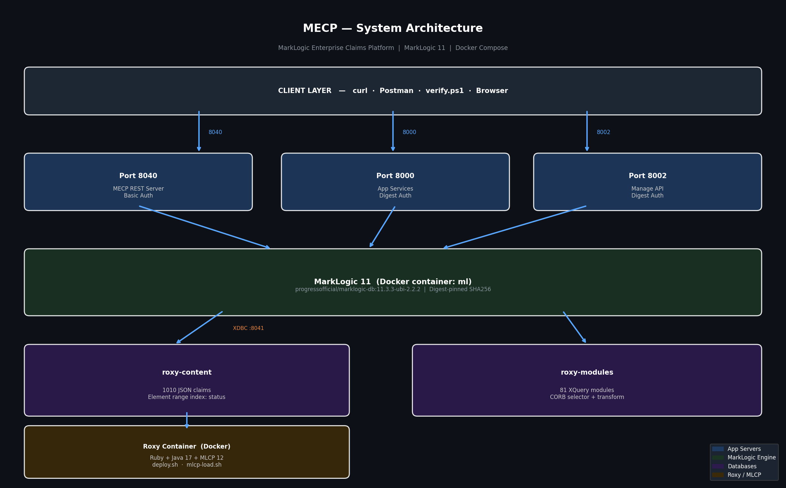
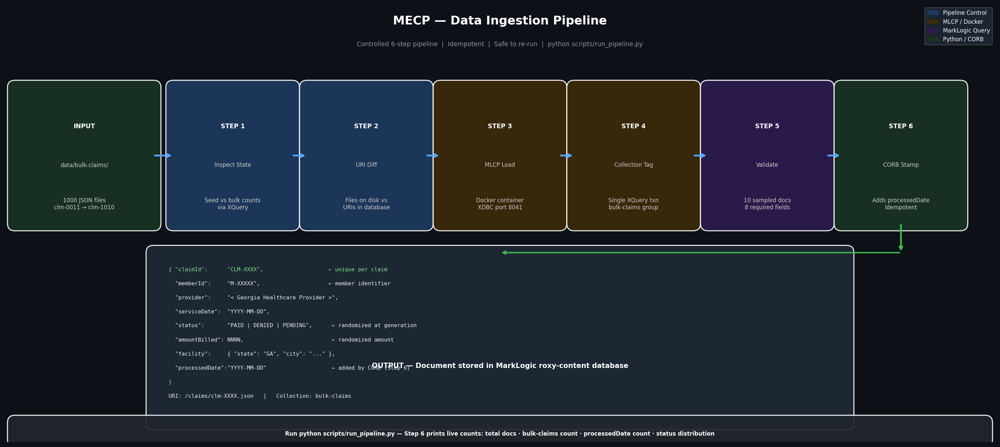

# MarkLogic Enterprise Claims Platform (MECP)

> Enterprise-grade healthcare claims processing platform built on **MarkLogic 11**
> Fully containerized · Deployable in 3 commands · Verifiable in 5 minutes

A production-style platform demonstrating senior MarkLogic developer capabilities
including REST API development, XQuery programming, range indexing, bulk data ingestion,
batch processing, and containerized deployment — built to federal consulting delivery standards.

---

## Quick Start

```powershell
# 1 — Clone
git clone https://github.com/PerdueCo/health-claims-hub
cd health-claims-hub

# 2 — Start (first run takes 2-3 minutes)
docker compose up -d
docker logs -f health-claims-hub-roxy-1

# 3 — Verify (run after you see "Roxy deploy COMPLETE")
.\scripts\verify.ps1          # Windows
./scripts/verify.sh           # Mac / Linux
```

**Expected result:**
```
========================================
Result: 6 PASSED | 0 FAILED
Platform is READY for demonstration
========================================
```

---

## System Architecture



```
+--------------------------------------------------+
|                  CLIENT LAYER                    |
|         curl · Postman · verify.ps1              |
+------------------+-------------------------------+
                   |
       +-----------+-----------+
       v                       v
+-------------+         +-------------+
|  Port 8040  |         |  Port 8000  |
|  REST API   |         |  App Svcs   |
|  basic auth |         | digest auth |
+------+------+         +------+------+
       |                       |
       +-----------+-----------+
                   v
+--------------------------------------------------+
|            MarkLogic 11  (Port 8002)             |
|                                                  |
|  Database: roxy-content                          |
|  +-- 1010 JSON healthcare claim documents        |
|  +-- Element range index on status field         |
|  +-- bulk-claims collection (1000 documents)     |
|                                                  |
|  Database: roxy-modules                          |
|  +-- 81 XQuery modules                           |
+--------------------------------------------------+
                   |
                   | XDBC :8041
                   v
+--------------------------------------------------+
|         Roxy Container (Docker)                  |
|   Ruby + Java 17 + MLCP 12 + deploy.sh           |
+--------------------------------------------------+
```

---

## Bulk Data Load (1000 Claims)

After the platform is running, load the full claim dataset:

```powershell
# Generate 1000 randomized claim documents
python scripts/generate_claims.py

# Run the controlled 6-step pipeline
python scripts/run_pipeline.py
```

**Expected pipeline output:**
```
STEP 1 - Inspecting database state
STEP 2 - Identifying missing documents
STEP 3 - Loading missing documents via MLCP (Docker)
STEP 4 - Validating loaded documents        10/10 passed
STEP 5 - Running CORB (stamp processedDate) 1010/1010 complete
STEP 6 - Final report
  Total documents              : 1010
  Bulk-claims collection       : 1000
  Documents with processedDate : 1010
  Status distribution          : PAID / DENIED / PENDING (randomized)
```

## Data Pipeline



---

## What This Platform Demonstrates

| Capability | Technology | Status |
|---|---|---|
| Containerized deployment | Docker Compose + Roxy | Complete |
| Automated bootstrap | Roxy ml deploy pipeline | Complete |
| REST API layer | XQuery on MarkLogic App Server | Complete |
| Claims collection endpoint | GET /v1/resources/claims | Complete |
| Status filter | ?status=PAID, DENIED, PENDING | Complete |
| Single claim lookup | ?id=CLM-0001 | Complete |
| Search and indexing | cts:values, element range index | Complete |
| Bulk data load | MLCP via Docker — 1000 claims | Complete |
| Batch processing | CORB — processedDate stamping | Complete |
| Controlled pipeline | 6-step idempotent run_pipeline.py | Complete |
| Semantic triples | RDF triple store, SPARQL | Planned |

---

## API Reference

### GET all claims
```powershell
curl.exe -u admin:admin123 http://localhost:8040/v1/resources/claims
```

### Filter by status
```powershell
curl.exe -u admin:admin123 "http://localhost:8040/v1/resources/claims?status=PAID"
curl.exe -u admin:admin123 "http://localhost:8040/v1/resources/claims?status=DENIED"
curl.exe -u admin:admin123 "http://localhost:8040/v1/resources/claims?status=PENDING"
```

### Single claim lookup
```powershell
curl.exe -u admin:admin123 "http://localhost:8040/v1/resources/claims?id=CLM-0001"
```

### Document count (ad-hoc XQuery)
```powershell
curl.exe --digest -u admin:admin123 `
  --data "xquery=cts:estimate(cts:true-query())&database=roxy-content" `
  http://localhost:8000/v1/eval
```

### Status distribution
```powershell
curl.exe --digest -u admin:admin123 `
  --data "xquery=for `$v in cts:values(cts:json-property-reference('status')) return concat(`$v,': ',cts:frequency(`$v))&database=roxy-content" `
  http://localhost:8000/v1/eval
```

**Sample response:**
```json
{
  "total": 1,
  "filter": "CLM-0011",
  "claims": [{
    "claimId": "CLM-0011",
    "memberId": "M-10043",
    "provider": "Statesboro Health Clinic",
    "serviceDate": "2025-08-19",
    "status": "PENDING",
    "amountBilled": 3437,
    "facility": { "state": "GA", "city": "Statesboro" },
    "processedDate": "2026-03-09"
  }]
}
```

---

## Port Reference

| Port | Service | Auth | Purpose |
|---|---|---|---|
| 8001 | MarkLogic Admin UI | admin/admin123 | Browser-based administration |
| 8002 | Manage API | Digest | Platform health and management |
| 8000 | App Services | Digest | /v1/eval, /v1/ping |
| 8040 | MECP REST Server | Basic | Claims API endpoints |
| 8041 | XDBC Server | Digest | MLCP bulk load, CORB batch |

---

## Repository Structure

```
health-claims-hub/
+-- README.md                         <- This file
+-- TESTING.md                        <- Three-level verification guide
+-- CORB_GUIDE.md                     <- CORB architecture and usage
+-- docker-compose.yml                <- One-command platform startup
|
+-- roxy/
|   +-- Dockerfile                    <- Ruby + Java 17 + MLCP 12
|   +-- deploy.sh                     <- Bootstrap and deploy automation
|   +-- mlcp-load.sh                  <- MLCP import script (baked into image)
|   +-- mlcp/lib/                     <- MLCP 12 jar files
|
+-- claims-roxy/
|   +-- deploy/
|   |   +-- build.properties          <- App server configuration
|   |   +-- local.properties          <- Docker connection settings
|   |   +-- ml-config.xml             <- Databases, forests, range indexes
|   +-- data/claims/                  <- 10 seed JSON claim documents
|   +-- src/app/
|       +-- claims.xqy                <- REST API controller (XQuery)
|
+-- data/
|   +-- bulk-claims/                  <- 1000 generated JSON claim documents
|
+-- docs/
|   +-- MECP_System_Architecture.png  <- System architecture diagram
|   +-- MECP_Data_Pipeline.png        <- Data pipeline diagram
|
+-- scripts/
    +-- generate_claims.py            <- Generates 1000 randomized bulk claims
    +-- run_pipeline.py               <- Controlled 6-step data pipeline
    +-- delete_bad_uris.py            <- Database cleanup utility
    +-- tag_collections.py            <- Collection tagging utility
    +-- verify.ps1                    <- Windows verification (6 tests)
    +-- verify.sh                     <- Mac/Linux verification (6 tests)
```

---

## Prerequisites

| Requirement | Version | Notes |
|---|---|---|
| Docker Desktop | 4.x or higher | https://www.docker.com/products/docker-desktop |
| Python | 3.8 or higher | For pipeline and generator scripts |
| Git | Any recent | https://git-scm.com |
| Java | 11 or higher | For CORB batch processing |
| RAM | 8 GB recommended | MarkLogic minimum is 4 GB |

No MarkLogic license required — the Docker image includes a free developer license.

---

## Infrastructure Decisions

**Why is the Docker image digest-pinned?**
Docker tags are mutable. A vendor can silently replace an image behind an existing tag.
The SHA256 digest pin in `docker-compose.yml` guarantees identical bytes on every machine,
every time — immune to upstream changes.

**Why is the range index in ml-config.xml?**
Admin UI changes live only in the Docker volume. A `docker compose down -v` destroys them.
Declaring the index in `ml-config.xml` means Roxy recreates it automatically on every
bootstrap — making the configuration reproducible and source-controlled.

**Why does MLCP run inside Docker?**
The bulk load script `mlcp-load.sh` is baked into the Roxy Docker image at build time.
This eliminates local Java and MLCP installation requirements and makes the pipeline
portable across any machine that has Docker — no path or environment configuration needed.

**Why two authentication methods?**
MarkLogic runs independent server types with separate auth configurations. The Manage API
and App Services use digest auth by default. The MECP REST server uses basic auth as
configured in `build.properties`. Each endpoint must be called with the correct method.

**Why is the pipeline idempotent?**
`run_pipeline.py` performs a URI-level diff before loading. If all 1000 documents are
already in the database, Step 3 is skipped entirely. CORB's selector module only returns
documents without a processedDate, so re-running never duplicates work.

---

## Verification

Three levels of verification are documented in `TESTING.md`:

| Level | What It Proves | How |
|---|---|---|
| Level 1 — Runtime | Platform is running and responding | `.\scripts\verify.ps1` |
| Level 2 — Persistence | Configuration survives a full rebuild | `docker compose down -v` + rebuild |
| Level 3 — Portability | Works on any machine from a fresh clone | Day 13 fresh clone test |

---

## Incident Documentation

During development a MarkLogic version upgrade caused three compounding failures:
Docker tag drift, authentication mismatch, and a missing element range index.
A full Root Cause Analysis with timeline, prevention controls, and lessons learned
is available in `docs/MECP_RCA_Prevention_Report.docx`.

---

## Development Roadmap

| Phase | Description | Status |
|---|---|---|
| Phase 1 | Docker + Roxy deployment pipeline | Complete |
| Phase 2 | 10 seed claims loaded, range index active | Complete |
| Phase 3 | Verify script — 6 PASSED | Complete |
| Phase 4 | /v1/resources/claims REST endpoint | Complete |
| Phase 5 | Single claim lookup — ?id=CLM-0001 | Complete |
| Phase 6 | CORB batch processing — processedDate | Complete |
| Phase 7 | MLCP bulk load — 1000 claims via Docker | Complete |
| Phase 8 | Controlled 6-step pipeline | Complete |
| Phase 9 | Architecture diagrams | Complete |
| Phase 10 | Semantic triples + SPARQL | Planned |
| Phase 11 | Fresh clone end-to-end test | Planned |
| Phase 12 | Final polish and v1.0 tag | Planned |
